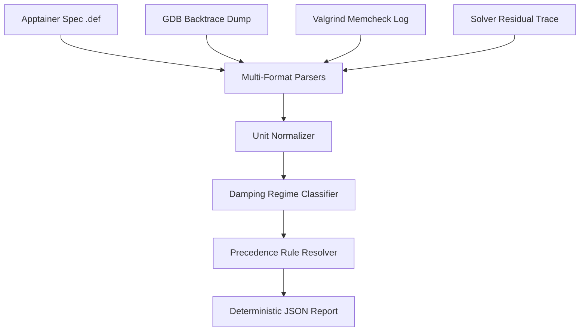

# 🚀 Apptainer Simulation Specs Diagnostics

[](https://experts.snorkel-ai.com/)
[]()
[](https://www.python.org/)

An offline diagnostic analysis engine and Snorkel Terminal-Bench benchmark task (`apptainer_diag`) that evaluates numerical stability risks for finite-volume groundwater simulation workflows packaged inside Apptainer containers.

---

## 📌 Overview

Finite-volume groundwater simulations packaged in Apptainer containers often fail due to complex interactions between low-level C memory corruption, container resource constraints, and mathematical PDE solver divergence. 

This repository implements a modular diagnostic tool (`apptainer_diag`) that ingests heterogeneous diagnostic logs, performs dimensional normalization across physical groundwater units, classifies solver residual damping regimes, and resolves contradictory crash signals using a strict 4-tier precedence hierarchy.

---

## 🏗️ Architecture & Pipeline Components



### 🔹 Component Breakdown

| Module | Location | Purpose |
| :--- | :--- | :--- |
| **Parsers** | `solution/apptainer_diag/parsers/` | Ingests Apptainer spec limits, GDB signals (`SIGSEGV`, `SIGFPE`), Valgrind memory leaks, and residual traces into typed models. |
| **Unit Normalizer** | `solution/apptainer_diag/analyzer/unit_converter.py` | Normalizes pressure heads ($ft, Pa, bar \to m$), volumetric flow rates ($gpm, m^3/d \to m^3/s$), and time steps ($hours \to s$). |
| **Damping Classifier** | `solution/apptainer_diag/analyzer/stability_scorer.py` | Analyzes norm ratios ($||r_{k+1}|| / ||r_k||$) across iteration histories to classify regimes (*Optimal*, *Stagnant*, *Oscillating*, *Divergent*). |
| **Precedence Resolver** | `solution/apptainer_diag/analyzer/precedence_resolver.py` | Resolves contradictory evidence using a 4-tier hierarchy to identify the primary root cause. |
| **Deterministic Reporter** | `solution/apptainer_diag/reporter.py` | Serializes component risk scores and precedence rationale into a key-sorted JSON report (`sort_keys=True`). |

---

## ⚖️ Precedence Hierarchy Rules

When diagnostic logs contain conflicting crash evidence, the engine applies a strict 4-tier rule hierarchy:

1. **Tier 1 — Valgrind Memory Corruption**: `Invalid write` or `Invalid free` takes top precedence over downstream GDB crash signals or matrix non-convergence.
2. **Tier 2 — Container Resource Limits**: Out-Of-Memory (OOM) or walltime breaches override solver divergence.
3. **Tier 3 — GDB SIGFPE Exception**: Pure floating-point arithmetic errors in numerical routines (when Valgrind is clean).
4. **Tier 4 — Algorithmic Damping Instability**: Solver non-convergence or time-stepping instability.

---

## 💻 Quick Start & Usage

### 1. Run Diagnostic Package CLI
```bash
python3 -m apptainer_diag.cli \
  --spec apptainer.def \
  --residuals solver.log \
  --valgrind valgrind.log \
  --gdb gdb.txt \
  --output report.json
```

### 2. Run Verification Tests
```bash
python3 -m pytest tests/test_outputs.py -v
```

### 3. Run Benchmark Agent Evaluation (via STB Harbor)
```bash
export OPENAI_API_KEY="<your-api-key>"
export OPENAI_BASE_URL="https://api.portkey.ai/v1"

stb harbor run -m @openai/gpt-5.5 -p .
```

---

## 📂 Repository Layout

```text
.
├── README.md               # Repository documentation
├── instruction.md          # Human-centric task description
├── task.toml               # Benchmark metadata schema (version 2.0)
├── environment/
│   └── Dockerfile          # Canonical ECR digest-pinned Python base image
├── solution/
│   ├── solve.sh            # Deterministic oracle solution script
│   ├── setup.py            # Package installer
│   └── apptainer_diag/     # Core diagnostic Python package
└── tests/
    ├── test.sh             # Verifier runner script
    ├── test_outputs.py     # Oracle unit test suite
    ├── test_parsers.py     # Parser unit tests
    └── test_analyzer.py    # Stability analyzer unit tests
```

---

## 📜 License
MIT License. Built for Snorkel Terminal-Bench Benchmark Submissions.
